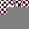

# insta-fuzz

**experiments in progress.**

_Fuzzers_ are tools that generate random data to trigger program crashes, usually used to test security-critical code. Some of the most security-critical code is image decoding - random images you see on the web should not crash your browser, or even worse, allow extracting sensitive data.

This project turns the fuzzing objective on its head: rather than treating a crash as a failure, we treat a crash as a *success*.

The fuzzer generates random input data, which the program tries to decode as a JPEG file. If the input data can be successfully decoded as a JPEG file, we can measure the decoded pixel values, and decide if we want to accept or reject the random data.

The aim is to make visible the structure of the JPEG file format, and to explore the capabilities and limitations of fuzzing tools.

## background reading

| name | link |
|-|-|
| JFIF spec | https://www.w3.org/Graphics/JPEG/jfif3.pdf |
| cargo-fuzz tutorial | https://rust-fuzz.github.io/book/introduction.html |

## experiment 1: generate a 32x32 image

aim: generate any kind of image using `cargo fuzz`

- metric: average pixel value in range [95, 100]
- without any corpus input, the fuzzer seems to not get anywhere
  - makes sense, it needs to generate a valid JPEG header, so let's help out...
- added corpus input: `fuzz/corpus/_1.jpg`
  - jpeg image scaled down to 32x32 using imagemagick `convert`
- generated `fuzz/artifacts/fuzz_target_1/crash-f7526ab6f00b6bfb89dd41ee6bba512dfa916e16`
  - size: 32x32
- result: some random pixels in top left corner, rest of image is grey
- grey pixels probably caused by output length being too small
  - end of file, but width/height pre-specified
- going to use `cargo fuzz run fuzz_target_1 -- -max_len=65536` from now on to try get bigger output
- repeated runs give same result, even though seed is different every time
  - though not sure of this, copied the output artifact, re-ran & `shasum`
  - the hash at the end of the file name is actually the shasum
- started logging different error types (jpeg `J`, format mismatch `F`, metric mismatch `M`) to see where it fails most often
- `cov: 38265` on success

## experiment 2: generate a 64x64 image

aim: generate a bigger image

- tried to change required size to 64x64
- result: stuck at format (no `M` errors, only `J`/`F`) - finding the exact value seems pretty hard
  - `cov` at ~13000
  - thought: would be amazing to see the coverage visualized
- gave up
- generated new 64x64 image `fuzz/corpus/_2.jpg` (from same source image as in #1)
- observed `M`, `cov` to ~38000
- successful run: generated `fuzz/artifacts/fuzz_target_1/crash-ffe8cb1c1efa03c503fd9b81617e1c380b6be70b`
  - start time: `10:46:13`
  - end time: `10:51:13`
  - size: 32x32
  - metric: pixel average ∈ [95, 100]
  - `cov: 38599` at last fail
  - file size: `3296`
- result:
  - top 16 rows of pixels recognisably from source image, next 8px row pink/red noise
  - last block of that row does not have color
  - rest of file is grey
- started logging resulting average value
- repeated run generates a new image `crash-d96bcc5af20d9378d78c6df574d87ed37e41d458`
  - `11:06:02` - `11:07:54`
  - only first row of blocks recognisable
  - file size: 2118 (67%)
  - average value: `91.954833984375`
- third run: `crash-c244bb058e1531e4d47175e26ed20f68031d4e1a`
  - `11:08:00` - `11:10:16`
  - two and a half rows recognisable, brown noise (similar to t shirt colors in image)
  - file size `4467`
  - `cov: 38650`

## experiment 3: more red pixels than others

aim: modify the success metric to generate more visually interesting output

- added pixel format to format check - needs to be RGB24
- changed iteration to iterate over pixels in chunks of 3
- defined a "red" pixel as a pixel where `r > g && r > b`
- metric: percentage of red pixels is >50%
- generated
  - `fuzz/artifacts/fuzz_target_1/crash-228690d1ed9d68ff6bde496469048ddbd4519834`
	- `fuzz/artifacts/fuzz_target_1/crash-30002adeb27d35d395fb0a2cd04d1ccc12450786`
	- `fuzz/artifacts/fuzz_target_1/crash-33c6aa9f30c008341a12b80430a9159c08176c7a`
	- `fuzz/artifacts/fuzz_target_1/crash-ac259af53c81bcb138b6fcbab2ea6b061f16298d`
- result: only first 3 blocks have some kind of value in them - at least they are red of sorts
- rest of image is #808080 grey
- changed red measurement: `r > 50 && r >= 2 * g && r >= 2 * b`
  - got overflows... need to cast to u16
  - that took way longer than expected, giving up - suspect red check is wrong somehow
  - added a debug log, red check looks ok, start again
- finished: `crash-083b80bb8a0a4dc80e56efc5466873f7d7bfb5b7`
  - metric: `0.5654296875`
  - but only 3 blocks are non-grey...

